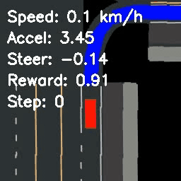
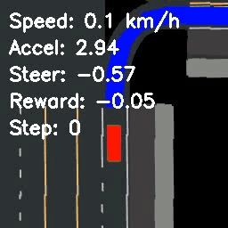
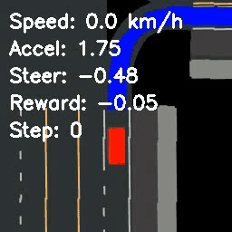

# End-to-End Motion Planning Using Reinforcement Learning

This repository contains implementations of four state-of-the-art reinforcement learning algorithms (TD3, PPO, SAC, and TSAC) for autonomous vehicle motion planning in the CARLA simulator. The approach uses bird's eye view (BEV) costmaps as state representation for end-to-end learning from perception to control.

<div align="center">
  
</div>

## Project Overview

Traditional autonomous driving systems often rely on modular pipelines with separate perception, planning, and control components. These approaches typically require extensive hand-engineering and have limited generalization capabilities across different scenarios.

This project explores end-to-end reinforcement learning as an alternative approach, directly mapping observations to control actions. We evaluate four different RL algorithms:

- **TD3** (Twin Delayed Deep Deterministic Policy Gradient)
- **PPO** (Proximal Policy Optimization)
- **SAC** (Soft Actor-Critic)
- **TSAC** (Transformer-based Soft Actor-Critic)

Our results show that TSAC achieves the best performance, with superior stability and reward accumulation compared to the other methods.

## Features

- Custom CARLA gym environment (based on [gym-carla](https://github.com/cjy1992/gym-carla)) adapted for CARLA 0.9.14
- Implementation of jaywalkers, pedestrians, and automatic traffic
- Support for both random and deterministic source/destination routing
- Visualization showing BEV costmap, lidar output, and front view camera image
- State representation using only the BEV color-encoded costmap

## Repository Structure

```
├── gym_carla
│   ├── __init__.py
│   └── envs
│       ├── __init__.py
│       ├── carla_env.py
│       ├── misc.py
│       ├── render.py
│       └── route_planner.py
├── RL algorithms
│   ├── PPO
│   │   ├── checkpoints
│   │   ├── record_test
│   │   ├── rgb_ppo.py
│   │   └── test_ppo.py
│   ├── SAC
│   │   ├── checkpoints
│   │   ├── record_test
│   │   ├── rgb_sac.py
│   │   └── test_sac.py
│   ├── TD3
│   │   ├── checkpoints
│   │   ├── record_test
│   │   ├── rgb_td3.py
│   │   └── test_td3.py
│   └── TSAC
│       ├── checkpoints
│       ├── record_test
│       ├── rgb_tsac.py
│       └── test_tsac.py
├── images
|
└── requirements.txt
```

## Requirements

- [CARLA 0.9.14](https://github.com/carla-simulator/carla/releases)
- Python 3.7+
- PyTorch
- Gym
- NumPy
- OpenCV
- Matplotlib
- TensorBoard
- Additional dependencies in requirements.txt

## Installation

1. Clone this repository:
   ```bash
   git clone https://github.com/Mahdi-Rahmani/End-to-End-Motion-Planning-Using-RL.git
   cd End-to-End-Motion-Planning-Using-RL
   ```

2. Install dependencies:
   ```bash
   pip install -r requirements.txt
   ```

3. Make sure CARLA 0.9.14 is properly installed. Visit the [CARLA Installation Guide](https://carla.readthedocs.io/en/latest/start_quickstart/) for more information.

## Usage

### Running CARLA Server

Before running any training or testing scripts, start the CARLA server:

```bash
./CarlaUE4.exe -carla-rpc-port=3000
```

### Training the Models

#### PPO
```bash
python rgb_ppo.py --episodes 100 --sync --steps-per-update 128 --mini-batch-size 64 --update-epochs 5 --lr 0.0003 --max-grad-norm 7.0 --pedestrians 0 --clip-param 0.1 --entropy-coef 0.02 --value-loss-coef 0.5
```

#### SAC
```bash
python rgb_sac.py --episodes 100 --sync --pedestrians 0 --auto-alpha
```

#### TD3
```bash
python rgb_td3.py --sync --episodes 100 --action-reg 0.01 --extreme-penalty 0.05 --rand-action-prob 0.15
```

#### TSAC
```bash
python rgb_tsac.py --sync --min-length 4 --max-length 8 --auto-alpha --hidden-dim 128 --batch-size 32 --utd-ratio 0.25 --critic-updates 100 --policy-updates 20
```

### Testing the Models

#### PPO
```bash
python test_ppo.py --model-path ./checkpoints/final_model.pth --episodes 50 --sync --record --output-dir ./test_results
```

#### SAC
```bash
python test_sac.py --model-path ./checkpoints/final_model.pth --episodes 50 --sync --record --output-dir ./sac_evaluation
```

#### TD3
```bash
python test_td3.py --model-path ./checkpoints/td3_final_model.pth --episodes 50 --sync --record --output-dir ./td3_evaluation
```

#### TSAC
```bash
python tsac_test.py --model-path ./checkpoints/final_model.pth --episodes 50 --sync --record --output-dir ./tsac_evaluation
```

## Results

We evaluated all four algorithms in the CARLA environment. Below are the results of our testing:

| TSAC | SAC | PPO | TD3 |
|:----:|:---:|:---:|:---:|
|  |  |  |  |

Key findings:
- TSAC achieved the best overall performance with improved stability and better reward accumulation
- SAC showed good adaptability but with less consistent performance than TSAC
- PPO demonstrated reasonable performance but struggled with stability in complex scenarios
- TD3 had the most difficulty with consistency and often resulted in erratic behavior

## Acknowledgments

- This project modifies the [gym-carla](https://github.com/cjy1992/gym-carla) environment to make it compatible with CARLA 0.9.14
- [CARLA Simulator](https://carla.org/) for providing the simulation environment
- The implementations of reinforcement learning algorithms are inspired by their respective original papers
